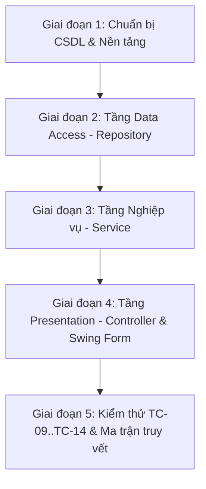

# KẾ HOẠCH DỰ ÁN: HỆ THỐNG QUẢN LÝ THƯ VIỆN (LIBRARY MANAGEMENT SYSTEM)
**Môn học:** Công nghệ Phần mềm (CNPM) — Nhóm 9 (6 thành viên)
**Nhánh Git tích hợp:** `dev`  

---

## 1. MỤC TIÊU VÀ PHẠM VI DỰ ÁN

### 1.1. Mục tiêu
Xây dựng ứng dụng Desktop Quản lý Thư viện hoàn chỉnh bằng **Java Swing + JDBC thuần + MySQL** phục vụ tại quầy thủ thư, đáp ứng 7 Use Case lõi đã được đặc tả trong SRS:
- **UC-01:** Đăng nhập (Login)
- **UC-02:** Tra cứu tài liệu (Search Book)
- **UC-03:** Tạo phiếu mượn sách (Create Borrow Slip)
- **UC-04:** Kiểm tra điều kiện mượn (Check Eligibility — `<<include>>` trong UC-03)
- **UC-05:** Xử lý trả sách (Return Book)
- **UC-06:** Cập nhật trạng thái và kho sách (Update Book Stock — nằm trong luồng UC-05)
- **UC-07:** Tính tiền phạt trễ hạn (Calculate Late Fine — nằm trong luồng UC-05)

### 1.2. Công nghệ & Ràng buộc (ĐÃ CHỐT)
- **Ngôn ngữ:** Java (JDK 8+).
- **Giao diện:** Java Swing thuần (Desktop App).
- **Truy xuất CSDL:** JDBC thuần (`PreparedStatement`), KHÔNG dùng ORM/Hibernate/JPA.
- **CSDL:** MySQL Server (quản lý qua MySQL Workbench).
- **Thư viện bên ngoài:** `lib/mysql-connector-j-8.3.0.jar` (đã nạp vào project).
- **Build tool:** Chạy trực tiếp qua IntelliJ IDEA hoặc `javac` (KHÔNG dùng Maven/Gradle).
- **Kiến trúc:** 4 tầng đóng (Closed 4-Layer) + MVC ở tầng Presentation:
  `ui/` → `controller/` → `service/` → `repository/` → MySQL Database.

---

## 2. PHÂN CÔNG VAI TRÒ TRONG NHÓM (6 THÀNH VIÊN)

| Thành viên | Trách nhiệm chính | Chi tiết module |
|---|---|---|
| **Người 1** | **UC-05, UC-06, UC-07 (Trả sách & Phạt)** + **Test/Debug toàn bộ dự án** | `ReturnService`, `ReturnController`, `PaymentRepository`, `ReturnBookForm`, `TestReturn.java`, khớp Ma trận truy vết (Bảng 17) & Bug Report (Bảng 19). |
| **Người 2** | UC-01 Đăng nhập | `LoginService`, `LoginController`, `AccountRepository`, `LoginForm` |
| **Người 3** | UC-02 Tra cứu tài liệu | `SearchService`, `SearchController`, `BookRepository` (phần tìm kiếm), `SearchBookForm` |
| **Người 4** | UC-03, UC-04 Mượn sách | `BorrowService`, `BorrowController`, `BorrowSlipRepository`, `BorrowDetailRepository`, `BorrowForm` |
| **Người 5** | Hạ tầng chung & CSDL | `DBConnection`, `SessionManager`, `MainApp`, chuẩn hóa script CSDL `QLTV.sql` |
| **Người 6** | Tầng Model chung | 8 Entity Model (`Account`, `Manager`, `Librarian`, `Student`, `PriorityStudent`, `Book`, `BorrowSlip`, `BorrowDetail`, `Payment`) + 2 DTO (`ReturnResult`, `FineInvoiceDTO`) |

---

## 3. LỘ TRÌNH THỰC HIỆN CHI TIẾT (5 GIAI ĐOẠN)

### Giai đoạn 1: Chuẩn bị CSDL & Nền tảng dùng chung
1. Rà soát, chuẩn hóa script SQL (`src/db/QLTV.sql` & `ThuVien_Indexes.sql`), sửa các điểm chưa khớp trong SRS (cột `ten_sach`, độ dài `mat_khau`, dữ liệu mẫu đủ 16 Test Case).
2. Kiểm tra `DBConnection.java` (kết nối Singleton JDBC có xử lý đóng tài nguyên).
3. Thống nhất và kiểm tra 8 Entity Model + 2 DTO (`ReturnResult`, `FineInvoiceDTO`).

### Giai đoạn 2: Tầng Data Access (Repository)
1. Xây dựng `PaymentRepository.java`:
   - `createFineRecord(String slipId, double fineAmount, String method, String status, Connection conn)`
2. Hoàn thiện các method trả sách trong `BorrowSlipRepository.java`:
   - `findActiveSlipByStudentId(String studentId)`
   - `updateReturnDate(String slipId, Timestamp returnDate, Connection conn)`
3. Hoàn thiện các method cập nhật tồn kho trong `BookRepository.java`:
   - `increaseStock(String bookId, int quantity, Connection conn)`

### Giai đoạn 3: Tầng Business Logic (Service)
Xây dựng `ReturnService.java`:
1. `getBorrowingDetailsByStudent(String studentId)`: Lấy thông tin phiếu mượn và danh sách sách đang mượn.
2. `verifyMatchingSlip(String slipId, String bookId)`: Kiểm tra mã sách quét có thuộc phiếu mượn của sinh viên không (sửa lỗi kiến trúc trong bản SRS cũ).
3. `calculateLateDaysAndFine(Timestamp dueDate, Timestamp returnDate, Student student)`:
   - Tính số ngày trễ = `ngay_tra_thuc_te - han_tra` (nếu âm thì = 0).
   - Tiền phạt = `so_ngay_tre * 5000`.
   - Nếu là sinh viên ưu tiên (`PriorityStudent`): giảm trừ theo `% muc_giam_gia`.
4. `confirmReturn(...)`: Quản lý giao dịch **Database Transaction (ACID)**:
   - Bắt đầu: `conn.setAutoCommit(false)`
   - Bước 1: Cập nhật `ngay_tra_thuc_te` phiếu mượn.
   - Bước 2: Tăng tồn kho `so_luong_con` của các đầu sách được trả (UC-06).
   - Bước 3: Tạo bản ghi phạt trong bảng `thanh_toan` nếu có trễ hạn / hỏng sách (UC-07) và cộng nợ sinh viên.
   - Bước 4: `conn.commit()`. Nếu bất kỳ lỗi nào xảy ra: `conn.rollback()`.

### Giai đoạn 4: Tầng Presentation (Controller & Form Swing)
1. Xây dựng `ReturnController.java`:
   - Nhận sự kiện từ Form, gọi `ReturnService`, nhận `ReturnResult` và trả về View.
2. Xây dựng `ReturnBookForm.java`:
   - Ô quét mã thẻ SV (bắt sự kiện `Enter` / Barcode Scanner).
   - Bảng danh sách sách đang mượn (đổi màu xanh khi quét đúng, cờ "Đã quét").
   - Ô quét mã sách từng cuốn, hiển thị cảnh báo đỏ nếu không khớp phiếu mượn.
   - Khu vực hiển thị tự động: Số ngày trễ, Tổng tiền phạt phát sinh.
   - Nút "Xác nhận trả sách" (xử lý loading, disable khi chưa quét cuốn nào, điều hướng kết quả).

### Giai đoạn 5: Kiểm thử, Báo cáo & Demo (Tiêu chí C6-D1)
1. Viết `tests/TestReturn.java` (Console Test) kiểm thử độc lập 6 Test Case:
   - **TC-09:** Trả đúng hạn (0 ngày) → không phạt, kho tăng.
   - **TC-10:** Trả trễ 3 ngày → phạt 15.000 đ, sinh viên thường.
   - **TC-11:** Trả trễ 1 ngày → phạt 5.000 đ.
   - **TC-12:** Quét mã sách không thuộc phiếu mượn → hiển thị banner cảnh báo, chặn xác nhận.
   - **TC-13:** Giả lập lỗi DB giữa chừng → rollback toàn bộ, phiếu không bị đóng dở dang.
   - **TC-14:** Trả một phần phiếu (quét 2/3 cuốn) → cập nhật đúng 2 cuốn, 1 cuốn còn lại giữ trạng thái mượn.
2. Hoàn thiện **Ma trận truy vết (Bảng 17 SRS)**: Ghi rõ vị trí file, dòng code tương ứng từng element thiết kế.
3. Hoàn thiện **Bug Report (Bảng 19 SRS)** và kịch bản Demo trực tiếp cho Giảng viên.

---

## 4. QUY TẮC PHỐI HỢP TRÊN GIT
- **Nhánh tích hợp chung:** `dev`
- **Nhánh làm việc cá nhân:** `feature/uc[SốUC]-[tên_ngắn]` (Ví dụ: `feature/uc05-return-book`, `feature/uc01-login`)
- **Quy chuẩn commit (100% Tiếng Anh):** `type(scope): description in English #UC-XX` (Chi tiết xem tại `CODING_STANDARDS.md`)
